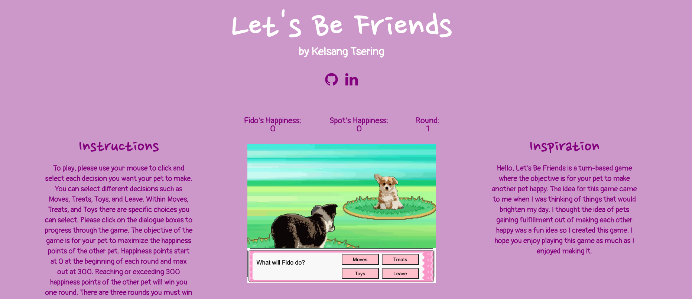
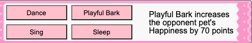

# Let's Be Friends

# <a href="https://kelsangt.github.io/Lets-Be-Friends/">Play the game here</a>



# Description 

Let's Be Friends is a turn-based game where the objective is to make your opponent's pet happy. The user competes and employs strategies to win against their opponent, choosing what moves, treats, and toys will be used in order to secure victory.

As the main objective of the game is for the pets to be happy, players start out with their pets' happiness meter being set to 0. Throughout the interaction, moves made by the player and the opponent will affect each other's pets' happiness meter. To win, the user will have to win 3 rounds against their opponent. If the user loses one round, the game is over. The user will, at any point during the game, be able to leave the game if they choose to. Winning is great, but the main idea for this game is that everyone becomes happy and hopefully strives to make one another happy.

# Controls 

Users will be able to play the game using mouse clicks.



# Functionality

In Let's Be Friends, users will be able to:

- Use their mouse to click on decisions to select the decision they want to make
- React to the moves and decisions made by the opponent, which will be controlled by the computer
- Hover over options to see what each move, treat, and toy does, in detail
- Leave the game while the game is being played
- Employ strategies in order to win through the use of moves, treats, and toys


In addition, this project will include:
- An instructions portion that will explain the game and the rules of the game
- Animations for the decisions choices 
- A README

# Wireframe


- The Game's title will be presented on the top of the screen.
- The Nav links will include links to my GitHub and LinkedIn profiles
- The game itself will be in the middle of the screen, composed of the portrayal of the user's pet, the opponent's pet, their respective stats, game prompt box, and user's decisions box.
- The Game prompts/Moves box will update to ask the user to make a move, and display the moves, treats, toys as the user selects one of them from the decisions box on the right.
- The Decisions box contains different choices for moves, treats, and toys. It also contains the ability for the user to leave the game.

# Technical Implementation 

Event listeners process moves and show description of moves

```javascript
let dance = document.getElementById("dance");

dance.addEventListener("click", e => {
    this.hide(dance);
    this.hide(playfulBark);
    this.hide(sing);
    this.hide(sleep);
    this.show(danceText);
    this.show(nextarrow);
    this.hide(danceDescription);
    this.opponentPet.hp += 50;
    opponentScore.innerHTML = "Spot's Happiness: " + this.opponentPet.hp;
});

danceText.addEventListener("click", e => {
    this.hide(danceText);
    this.computerInputs.pickDecision(this);
});


dance.addEventListener("mouseover", e => {
    this.hide(playfulBarkDescription);
    this.hide(singDescription);
    this.hide(sleepDescription);
    this.show(danceDescription);
});
```

Computer move logic

```javascript
pickDecision(userInput){
    const choicesArray = [
        ["Dance", 50],
        ["Sing", 30],
        ["Sleep", 40],
        ["PlayfulBark", 50],
        ["Jerky", 30],
        ["ChewyBeef", 40],
        ["MilkBone", 50],
        ["ChickenSticks", 20],
        ["Frisbee", 50],
        ["SqueakyBall", 30],
        ["GiraffePlush", 20],
        ["RubberBone", 40]
    ];
    let randomIndex = (Math.floor(Math.random() * choicesArray.length));
    let pickedChoiceName = choicesArray[randomIndex][0];
    let pickedChoiceVal = choicesArray[randomIndex][1];
    
    if(this.opponentPet.hp <300){
        this.playerPet.hp += pickedChoiceVal;
        playerScore.innerHTML = "Fido's Happiness: " + this.playerPet.hp;
    }
    if ((this.opponentPet.hp < 300) && (this.playerPet.hp < 300)){
        let element = document.getElementById("computer" + pickedChoiceName + "Text");
        element.style.display = "block";
        element.addEventListener("click", e => {
            element.style.display = "none";
            if((this.playerPet.hp < 300) ){
                userInput.hide(nextarrow);
                userInput.show(moves);
                userInput.show(treats);
                userInput.show(toys);
                userInput.show(leave);
                userInput.show(whatsnext);
            }
        });
    }
    userInput.checkEverything();    
}
```

Checking for game conditions after user and computer both make a move

```javascript
checkEverything(){
    if(this.playerPet.hp >= 300){
        this.renderDefeat();
        this.mainGame.losses += 1;
    }
    if(this.opponentPet.hp >= 300){
        if (this.mainGame.wins < 2){
            this.renderFade();
        }
        this.mainGame.wins += 1;
    }
    if(this.mainGame.wins >= 3){
        this.renderVictory();
    }
}
```

# Technologies, Libraries, APIs

This project will be implemented with these technologies:
- `Canvas API` in order to display and render the game screen
- `Webpack` and `Babel` to bundle Javascript code
- `npm` to manage dependencies of the project 

# Timeline

- **Thursday Afternoon**: Setup the project, sort out webpack, and research the Canvas API. Get the files up and running and figure out how the files interact with each other.
- **Friday**: Work on the game logic to figure out what each decision does and how it is coded.
- **The Weekend:** Finish up on the logic for the game and research animation to make the visuals of the game pop.
- **Monday:** Get the game to work on the screen and for the user to be able to play the game to its entirety. 
- **Tuesday:** Devote time to working on the styling of the game, making sure the presentation is great and fits my vision for the game.
- **Wednesday:** Improve styling of the game, see if I can expand the game if the timeline is going according to plan.
- **Thursday:** Deploy project to GitHub pages. Look over all the files and make revisions as needed.


# Bonus Features

- This game can be expanded by adding a 2D walking aspect: The user model can walk around a town, interacting with other people to begin interactions. This will then transition to the competitive interaction mode, where the user makes decisions in order to win the interaction.
- Another expansion is the ability to have multiple pets and swap between them during the competition
- This game could also have animations for specific moves made by the pets and idle animation
